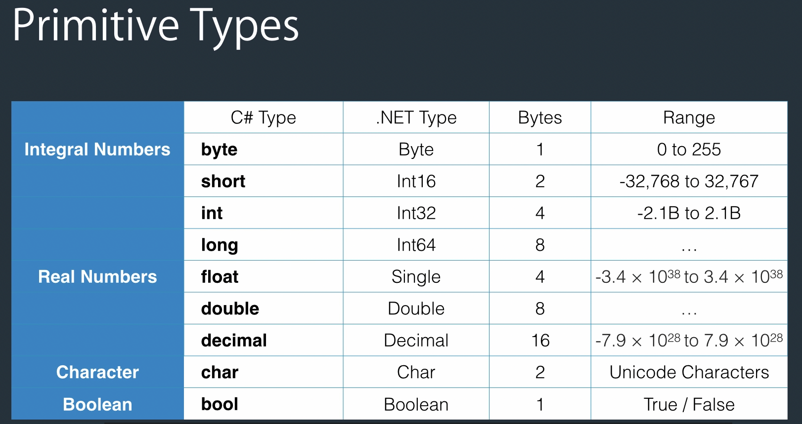

# c# Basics for Beginners 

https://www.udemy.com/course/csharp-tutorial-for-beginners/learn/lecture/2169104?start=75#overview


### Sction 2: Introduction to C# and .Net Framework

##### C# vs .Net

- C# is a programming language
- .Net is a framework for building applications on Windows
- C# is a programming language, while .NET is a framework. It consists of a run-time environment (CLR) and a class library that we use for building applications.

##### .Net

- CLR (Common Language Runtime)
  - When you compile an application, C# compiler compiles your code to IL (Intermediate Language) code. IL code is platform agnostics, which makes it possible to a take a C# program on a different computer with different hardware architecture and operating system and run it. For this to happen, we need CLR. When you run a C# application, CLR compiles the IL code into the native machine code for the computer on which it is running. This process is called Just-in-time Compilation (JIT).
- Class Library


### Sction 3: Primitive Types and Expressions

#### 3.15 Variables and Constants

- Variable - a name given to a storage location in memory.

  - Identifiers - Cannot start with a number (eg: 1num)
  - Identifiers - Cannot include a whitespace. (eg: first name)
  - Identifiers - Cannot be a reserved keyword. (eg: int  but can @int)
  - User meanigful names ( eg: fn (not good) || firstName (Good))

- Constant: an immutable (永恒的) value.

- Naming Conventions

  1. Camel Case： firstname
  2. Pascak Case： FirstName
  3. Hungarian Notation：strFirstName (type + Pascak case) ugly one

  - For Local variablers: Camel Case   -  int number;
  - For constants: Pascak Case          -   const int MaxZoom = 5;


Value Types:

Primitive Types (基本类型)



- float number = 1.2f;
- decimal number = 1.2m;

#### 3.16 Overflowing 

```c#
byte number = 255; // byte 0 - 255
number = number + 1; // 0


// if U want to stop water flowing 不超出type 的容量
checked
{
  byte number = 255;
  
  number = number + 1;
}
```


#### 3.17 Scope 

- Where a variable / constant has meaning.

  ```c#
  {
    byte a = 1;
    {
      byte b = 2;
      {
        byte c = 2;
      }
    } // A block is indicated （表示） by curly braces.
  } 
  ```

#### 3.19 Agenda (议程)

- Implicit type conversion 隐试

  ```c#
  byte b = 1; // 00000001
  int i = b; // 00000000 00000000 00000000 00000001
  // 少的byte i可以直接转换成int
  ```

- Explicit type conversion (casting) 显示

  ```c#
  int i = 1;
  byte b = i; // !error won't compile could be data loss
  
  //========================
  int i = 1;
  byte b = (byte) i;
  ```

- Conversion betweem non-compatible types 非兼容类型

  ```c#
  string s = "1";
  int i = (int) s; //  won't compile
  
  //========================
  string s = "1";
  int i = Convert.ToInt32(s);
  int j = int.Parse(s);
  ```

  Converr

  - ToByte()
  - ToInt16()
  - ToInt32()
  - ToInt64()

####  3.21 Operators

- Arithmetic ( + | - | * | / | % | ++ | -- )
- Comparison ( == | != | > | >= | < | <= )
- Assignment ( = | += | -= | *= | /= )
- Logical ( && , || , ! ) == ( and | or | not )
- Bitwise ( & ,  | )

